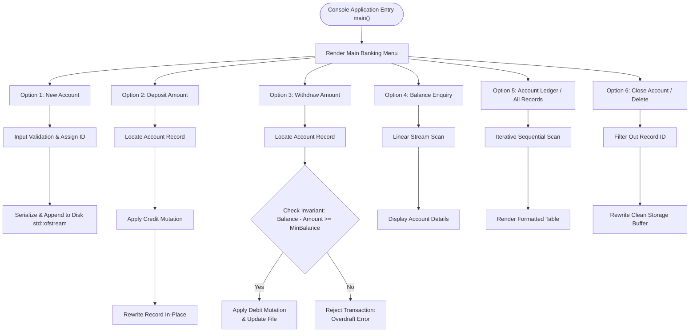

# Bank Management System (C++)


## Executive Overview
Developing reliable financial software requires an uncompromising commitment to mathematical invariants, robust state transition architectures, and durable serialization protocols. This project serves as a foundational C++ **Bank Management System**, utilizing Object-Oriented paradigms to encapsulate transactional ledgers. It safely abstracts direct memory mutations behind discrete methods (Deposits, Withdrawals) while preserving the total system state directly onto non-volatile disk streams.

> [!CAUTION]
> **Financial Data Integrity & Software Reliability Callout**
> Simulating banking logic introduces severe failure vectors:
> - **Overdraft Violations:** If withdrawal logic does not enforce boundary invariants, malicious or erroneous deductions can result in negative account balances.
> - **Database Corruption:** Abrupt termination of the program mid-stream write (`std::ofstream`) will irreversibly corrupt the local ledger files.
> - **Floating-Point Drift:** Utilizing standard IEEE-754 `float`/`double` data types for currency invariably introduces rounding arithmetic errors over millions of transactions; financial applications mandate scaled integer arithmetic (fixed-point).
> - **Input Validation:** Raw `std::cin` streams must be rigidly sanitized and flushed (`std::cin.ignore()`) to prevent cascading segmentation faults upon injection of invalid character types.

## System Highlights
- **Object-Oriented Account Modeling**: Core logic encapsulated within a dedicated `class account`, binding private ledger variables to public transactional mutators.
- **Persistent Disk Serialization**: Account objects are physically serialized to disk in binary/formatted layouts using raw C++ file streams (`std::fstream`).
- **Transactional State Operations**: Supports standard CLI banking functions: New Account Creation, Ledger Modification, Deposits, Withdrawals, and Full Deletion.
- **Formatted Tabular Statements**: Leverages `<iomanip>` manipulators (`setw`, `setfill`) to render strict column-aligned account ledgers.

## Software Architecture Flowchart



## Algorithmic & Transaction Mathematical Models

### 1. Balance State Transition & Invariant

Every account balance state $B(t)$ evolves sequentially under strict ACID constraint validation:

$$
B(t + 1) = B(t) + \Delta B, \quad 	ext{where } \Delta B = 
egin{cases} 
+D & 	ext{if } D > 0 	ext{ (Deposit)} \
-W & 	ext{if } W > 0 	ext{ (Withdrawal)} 
\end{cases}
$$

**System Invariant (Strict Overdraft Prohibition):**

$$
B(t + 1) \ge B_{\min}
$$

### 2. Currency Fixed-Point Scaling

To prevent catastrophic IEEE-754 floating-point precision drift, all currency values are scaled by $10^2$ into integer minor units (cents):

$$
B_{	ext{scaled}} = 	ext{round}(B 	imes 10^2) \in \mathbb{Z}
$$

### 3. Complexity Analysis Matrix

Operating upon raw binary record streams establishes deterministic performance bounds:

* **Account Creation (Append):** $\mathcal{O}(1)$ time, $\mathcal{O}(1)$ auxiliary space
* **Linear Account Search by ID:** $\mathcal{O}(N)$ time
* **In-Place Record Update:** $\mathcal{O}(N)$ time (sequential scan), bounded $\mathcal{O}(1)$ auxiliary memory
* **Complete Ledger Scan & Display:** $\mathcal{O}(N)$ time

### 4. Binary Record File Offset Addressing

Direct random access to record $k$ within the contiguous binary database stream is evaluated in $\mathcal{O}(1)$ time via deterministic offset addressing:

$$
	ext{Seek Offset}(k) = (k - 1) 	imes 	ext{sizeof}(	ext{Account})
$$

## Build & Compilation Matrix
To compile this project natively via a MinGW/GCC toolchain:

```bash
g++ -O2 "src/Code for Bank Management System Project in C++ .cxx" -o bin/bank_system.exe
```

## Repository Layout Tree
```text
📦 Bank Management System
 ┣ 📂 src/             # Core C++ application source code
 ┃ ┗ 📜 Code for Bank Management System Project in C++ .cxx
 ┣ 📂 docs/            # Engineering documentation (Future)
 ┣ 📂 bin/             # Compiled executable binaries (Ignored in Git)
 ┣ 📜 README.md        # This document
 ┣ 📜 LICENSE          # MIT License
 ┗ 📜 .gitignore       # Build artifact and local database exclusions
```

## Authentic Artifacts Catalog
- **Source Code Implementation**: Available directly within [`src/`](src/).

## Engineering Audit & Tradeoffs
- **Unencrypted Flat-File Storage vs. ACID RDBMS**: Writing financial structs directly to text/binary files is educational but lacks Atomicity, Consistency, Isolation, and Durability (ACID). Modern banking ledgers absolutely require relational engines (like PostgreSQL) to prevent record collisions during concurrent threading.
- **Binary Serialization Portability**: If the `class account` is written directly to an `fstream` using byte casting (`reinterpret_cast<char*>`), the generated `.dat` file is completely rigid to the specific CPU architecture. Differences in machine Endianness or compiler struct-padding will instantly corrupt the financial records if the file is moved between systems.

---

**Hassan Moqbel Morshed Ghaleb**
Mechatronics Engineer | Mechanical Design & CAD (SolidWorks & AutoCAD) | Preventive Maintenance & Electromechanical Systems | Industrial Automation, Control Systems, Robotics & Intelligent Machines | CAD/FEA, Embedded Systems, Python & C++
[GitHub](https://github.com/Hassan-Moqbel) · [Facebook](https://www.facebook.com/share/1BqxAgVjHi/) · [LinkedIn](https://www.linkedin.com/in/hassan-moqbel)

## License
This project is licensed under the [MIT License](LICENSE).
